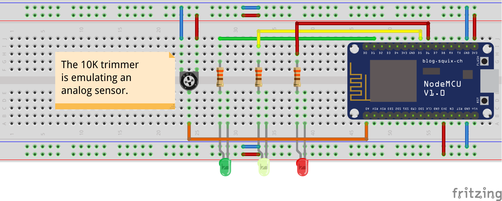

# Tesla Tech Talk

> ### Backend Development using Node.js
>
> ### IoT Development using NodeMCU ESP8266

> **Date:** 9th - 10th January 2021  
> **Time:** 7 PM - 9 PM IST

## Project Description

> #### **A traffic light management application using Node.js Backend, and NodeMCU ESP8266**

## Circuit Diagram



###### Made using [Fritzing](https://fritzing.org/)

## Installation Instructions:

**You should have the following installed:**

- Node.js 14.15.4 LTS
- Arduino IDE
- ESP8266 should be added through Board Manager. [**Link to the guide.**](https://create.arduino.cc/projecthub/electropeak/getting-started-w-nodemcu-esp8266-on-arduino-ide-28184f)
- Install `WiFiManager` and `ArduinoJson` library. [**Link to the guide**](https://www.arduino.cc/en/guide/libraries)

**Power up your NodeMCU**

- Your NodeMCU should form a WiFi Hotspot with the SSID `ESP<Some string>`
- Connect to that WiFi and navigate to `192.168.4.1`
- Enter your WiFi credentials and save it
- Your NodeMCU will restart
- Go to your router settings and note down your NodeMCU IP

**Create a `.env` file in the root directory with the following contents:**

```javascript
PORT = 4200;
NODE_ENV = "production";
NODEMCU_HOSTNAME = "<Your NodeMCU IP>:8080";
```

**Install Node Dependencies and Start Server**

```bash
npm install
npm start
```

**Go to `localhost:4200` and use the dashboard!**
